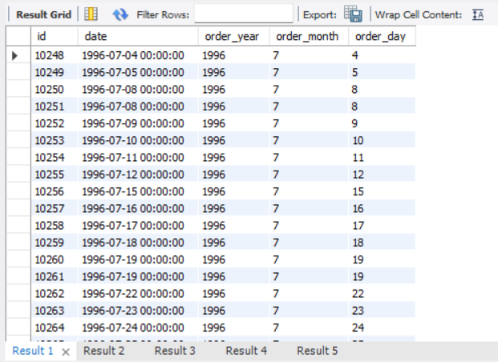
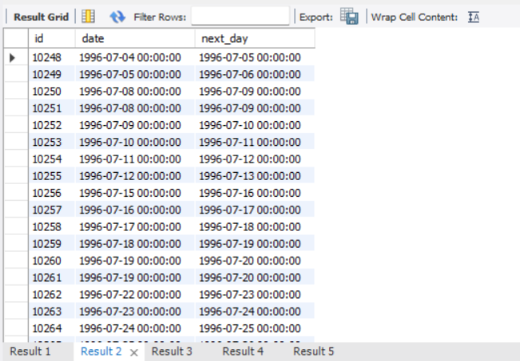
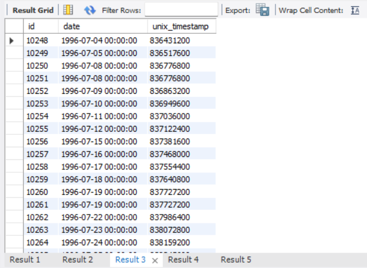
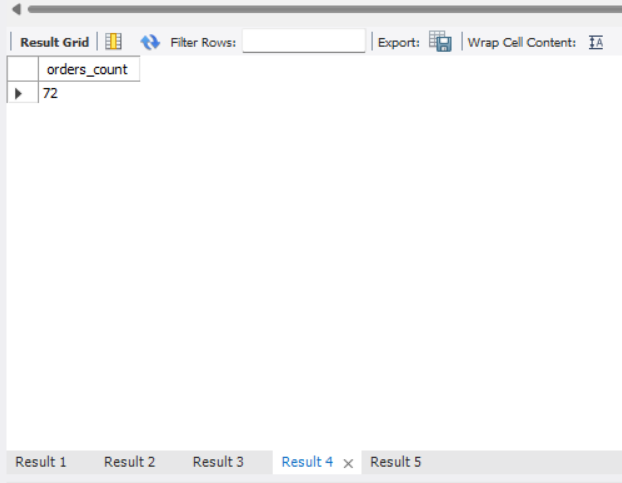
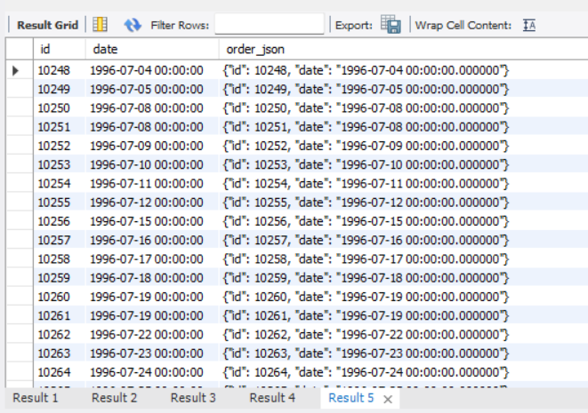

# Homework 7 — Additional Built-in SQL Functions. Working with Time

## Overview

This homework demonstrates the use of built-in SQL date/time functions and JSON functions for the `orders` table.

Database used in the task: `goit-rdb-hw-03`

Main SQL file: `queries.sql`

---

## Repository Structure

```text
.
├── README.md
├── queries.sql
└── images/
    ├── p1.png
    ├── p2.png
    ├── p3.png
    ├── p4.png
    └── p5.png
```

---

## Step 1. Extract year, month, and day from `date`

This query extracts the year, month, and day from the `date` column and displays them together with `id` and the original `date` value.

### SQL

```sql
SELECT
    id,
    `date`,
    YEAR(`date`) AS order_year,
    MONTH(`date`) AS order_month,
    DAY(`date`) AS order_day
FROM orders;
```

### Screenshot



---

## Step 2. Add one day to `date`

This query adds one day to the `date` column and shows the original and modified values.

### SQL

```sql
SELECT
    id,
    `date`,
    DATE_ADD(`date`, INTERVAL 1 DAY) AS next_day
FROM orders;
```

### Screenshot



---

## Step 3. Display the Unix timestamp value

This query converts the `date` value into the number of seconds since the Unix epoch.

### SQL

```sql
SELECT
    id,
    `date`,
    UNIX_TIMESTAMP(`date`) AS unix_timestamp
FROM orders;
```

### Screenshot



---

## Step 4. Count rows within a date range

This query counts how many rows in the `orders` table have `date` values between `1996-07-10 00:00:00` and `1996-10-08 00:00:00`.

### SQL

```sql
SELECT
    COUNT(*) AS orders_count
FROM orders
WHERE `date` BETWEEN '1996-07-10 00:00:00' AND '1996-10-08 00:00:00';
```

### Screenshot



---

## Step 5. Create a JSON object

This query builds a JSON object for each row in the format:

```json
{"id": <row id>, "date": <row date>}
```

### SQL

```sql
SELECT
    id,
    `date`,
    JSON_OBJECT(
        'id', id,
        'date', `date`
    ) AS order_json
FROM orders;
```

### Screenshot



---

## Full SQL Code

```sql
USE `goit-rdb-hw-03`;

-- Step 1.
SELECT
    id,
    `date`,
    YEAR(`date`) AS order_year,
    MONTH(`date`) AS order_month,
    DAY(`date`) AS order_day
FROM orders;

-- Step 2.
SELECT
    id,
    `date`,
    DATE_ADD(`date`, INTERVAL 1 DAY) AS next_day
FROM orders;

-- Step 3.
SELECT
    id,
    `date`,
    UNIX_TIMESTAMP(`date`) AS unix_timestamp
FROM orders;

-- Step 4.
SELECT
    COUNT(*) AS orders_count
FROM orders
WHERE `date` BETWEEN '1996-07-10 00:00:00' AND '1996-10-08 00:00:00';

-- Step 5.
SELECT
    id,
    `date`,
    JSON_OBJECT(
        'id', id,
        'date', `date`
    ) AS order_json
FROM orders;
```

---

## Conclusion

The homework includes:

* extracting date parts from a datetime value;
* adding an interval to a date;
* converting a datetime value to a Unix timestamp;
* filtering rows by a datetime range;
* creating JSON objects directly in SQL.
